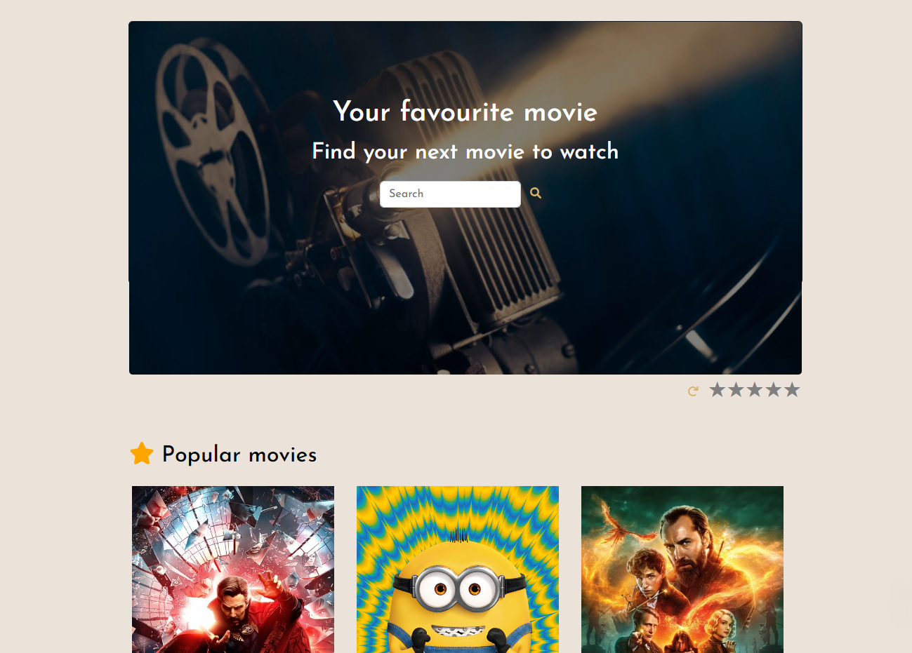

# TheMovieDB

Aplicación web simple que permite a los usuarios descubrir nuevas películas y buscarlas.

[DEMO](https://namined.github.io/TheMovieDB/)

## ¿Cómo lo ejecuto en local? 🔧

```
1. Clona este proyecto.
2. Instala las dependencias ### npm install
3. Corre el ambiente local ### npm start
```

## Construido con 🛠️

Herramientas que utilice:

- Axios [Axios](https://www.npmjs.com/package/axios)
- Font Awesome [Font Awesome](https://fontawesome.com/)
- Bootstrap [Bootstrap](https://getbootstrap.com/)



## Licencia 📄

MIT
